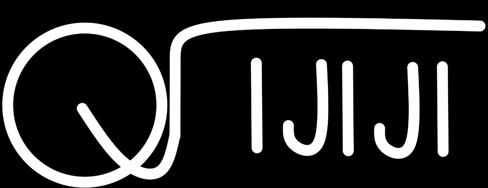
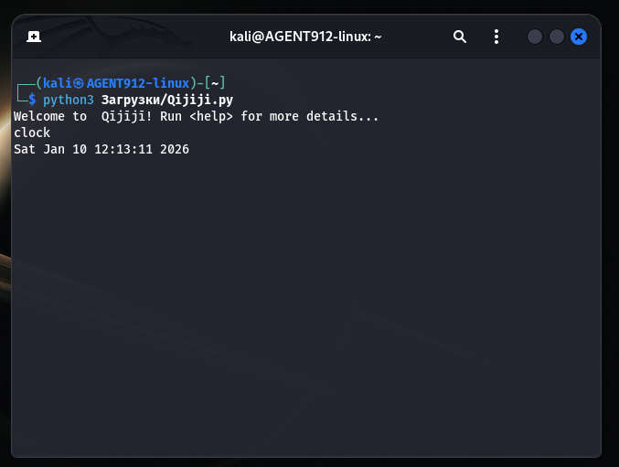

# Qījījī
Qījījī is a simple CLI clock app written in Python with such functions as clock, timer, stopwatch and alarm. It could be released at 30th January 2026

Here is an example of running Qījījī:

